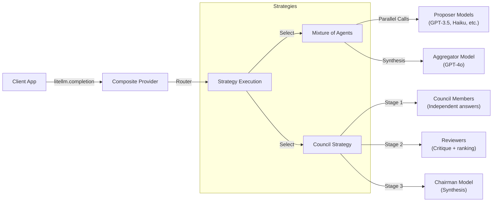

# Composite LLM: Idea & Design Document

## 1. Overview

**Composite LLM** is an extension architecture for `litellm` that enables "Logical Models"—abstractions that look like a single LLM to the client but actually orchestrate multiple underlying LLM calls behind the scenes.

The goal is to provide advanced capabilities like **Mixture-of-Agents (MoA)** and **Council-style deliberation** while maintaining a unified, standard chat completion API.

### Core Value Proposition
- **Unified Interface**: Client code remains unchanged. Switching from `gpt-4o` to a complex `composite/moa/gpt-4o` pipeline requires only a config string change.
- **Model Agnostic**: Strategies can mix and match models from different providers (e.g., Anthropic for proposer models, OpenAI for synthesis).
- **Introspection**: Built-in observability to track the "hidden" cost and latency of composite operations.

---

## 2. Architecture

The system is built around a **Custom Provider** pattern compatible with `litellm`.



### Components

1.  **CompositeLLMProvider**: The entry point. It intercepts calls where the model name starts with `composite/`. It parses the strategy and configuration from the model string.
    *   *Format*: `composite/<strategy>/<base_model>`
    *   *Example*: `composite/moa/gpt-4o`

2.  **BaseStrategy**: An abstract base class defining the contract for all orchestration logic.
    *   `execute(messages, model_config, optional_params, litellm_params)`

3.  **Observability Layer**: A callback system that logs granular metrics (latency, token usage, cost) for both the composite call and the sub-calls.

---

## 3. Supported Strategies

### A. Mixture-of-Agents (MoA)
Inspired by recent research (e.g., Together AI's MoA), this strategy leverages the collective intelligence of multiple models.

*   **Workflow**:
    1.  **Proposer Phase**: The user query is sent in parallel to a set of diverse, cheaper "proposer" models (e.g., Llama-3, Haiku, GPT-3.5).
    2.  **Aggregator Phase**: The responses from all proposers are collected and injected into the context of a capable "aggregator" model (e.g., GPT-4o or Claude 3.5 Sonnet).
    3.  **Synthesis**: The aggregator generates the final response, correcting errors and combining insights.
*   **Config**: `proposers` (list of models), `aggregator` (base model).

### B. Council Strategy (LLM Council-style)
Inspired by Andrej Karpathy's [LLM Council](https://github.com/karpathy/llm-council), this strategy runs a 3-stage pipeline of multiple models.

*   **Workflow**:
    1.  **First Opinions (Stage 1)**: The user query (full conversation) is sent individually to a set of council models. Each model returns its own answer.
    2.  **Cross-review & Ranking (Stage 2)**: Each (review) model is shown all anonymized answers (e.g., “Assistant 1”, “Assistant 2”, …) and asked to critique and rank them by accuracy and insight.
    3.  **Chairman Synthesis (Stage 3)**: A designated chairman model receives the original conversation plus a formatted summary of Stage 1 answers and Stage 2 reviews, and produces the final answer.
*   **Config** (via `optional_params`):
    *   `council_models`: list of council member models used in Stage 1 (and by default Stage 2).
    *   `chairman_model`: model used in Stage 3 to synthesize the final answer (defaults to the `<model>` part of `composite/council/<model>`).
    *   `review_models` (optional): list of models to use as reviewers in Stage 2 (defaults to `council_models`).
    *   `max_council_size` (optional): cap on the number of council members/reviewers to use.

---

## 4. Technical Implementation Details

### Integration with LiteLLM
We utilize `litellm`'s custom provider capabilities.

```python
# Pseudo-code usage
resp = litellm.completion(
     model="composite/moa/gpt-4o",
    messages=[{"role": "user", "content": "Complex query..."}],
    # Custom params passed through
    proposers=["claude-3-haiku", "gpt-3.5-turbo"]
)
```

### Tool Call Handling
Handling tool calls in a composite architecture is non-trivial.

*   **Strategy 1 (Pass-through)**: If the underlying model (e.g., the Aggregator in MoA) generates a tool call, it is bubbled up to the client. The client executes the tool and sends the result back. The Composite Provider must be state-aware to route the tool output back to the correct step in the strategy.
*   **Strategy 2 (Internal Execution)**: The Composite Provider handles the tool execution internally (agentic loop) and only returns the final text result. *This is more complex but hides implementation details.*
*   **Current Design**: Tool calls generated by the *final* model are returned to the client by default. If a `tool_executor` is provided, the provider can execute tool calls and resume the flow.

---

## 5. Observability & Dashboard

Since one API call now triggers $N$ calls, cost and latency transparency is critical.

*   **Logging**: All sub-calls are logged to a structured `jsonl` file.
*   **Dashboard (Streamlit)**:
    *   **Aggregated Metrics**: Total cost per composite call.
*   **Trace View**: Timeline showing the parallel execution of MoA proposers or the sequential steps of the Council pipeline.
    *   **Latency Analysis**: Identify which sub-model is the bottleneck.

## 6. Directory Structure

```text
composite_llm_research/
├── composite_llm/
│   ├── provider.py       # Main Provider Class
│   ├── strategies/       # Strategy Implementations
│   │   ├── base.py
│   │   ├── moa.py
│   │   └── council.py
│   └── observability.py  # Logging Callbacks
├── dashboard.py          # Streamlit Visualization
├── demo.py               # Usage Examples
└── DESIGN.md             # This file
```

---

## 7. Quick Start & Testing

This section explains how to set up the environment using `uv`, run the demo, and view the observability dashboard.

### 7.1 Prerequisites & Setup

Ensure you have `uv` installed. If not, install it via `curl -LsSf https://astral.sh/uv/install.sh | sh`.

1.  **Create a virtual environment**:
    ```bash
    uv venv
    source .venv/bin/activate
    ```

2.  **Install dependencies**:
    ```bash
    uv pip install -e .
    ```

### 7.2 Environment Configuration

Create a `.env` file in the root directory (you can copy `sample.env`):

```bash
cp sample.env .env
```

Edit `.env` to add your API keys. You can use standard provider keys (e.g., `OPENAI_API_KEY`, `ANTHROPIC_API_KEY`) or `LITELLM_API_KEY` for general use.

Example `.env`:
```text
LITELLM_API_KEY=csk-...
MODEL=cerebras/zai-glm-4.6
```

*Note: If no API key is provided, `demo.py` will run in **Mock Mode**, simulating responses without making actual network calls.*

### 7.3 Running the Demo

The `demo.py` script showcases two strategies: **MoA** (Mixture of Agents) and **Council** (LLM Council-style).

```bash
python demo.py
```

Expected output:
1.  **MoA Strategy**: It will simulate querying multiple proposer models and then aggregating their responses.
2.  **Council Strategy**: It will run the three-stage council pipeline and print the synthesized answer.
3.  **Logging**: All interactions are automatically logged to `llm_logs.jsonl` in the current directory.

### 7.4 Running the Observability Dashboard

To visualize the metrics (latency, token usage, model distribution), start the Streamlit dashboard:

```bash
streamlit run dashboard.py
```

This will open a local web server (usually at `http://localhost:8501`) where you can see:
-   Total calls and error rates.
-   Latency distributions.
-   A table of recent logs (which updates as you run more demos).

### 7.5 Manual Testing (Python Shell)

You can also test interactively using the LiteLLM custom provider:

```python
import litellm
from composite_llm.litellm_provider import register_composite_provider

# Ensure API key is set
# os.environ["OPENAI_API_KEY"] = "..."

register_composite_provider()

# Test a simple composite call
resp = litellm.completion(
    model="composite/council/gpt-4o",
    messages=[{"role": "user", "content": "Why is the sky blue?"}],
    optional_params={"council_models": ["gpt-4o-mini", "gpt-4o"]}
)
print(resp.choices[0].message.content)
```
